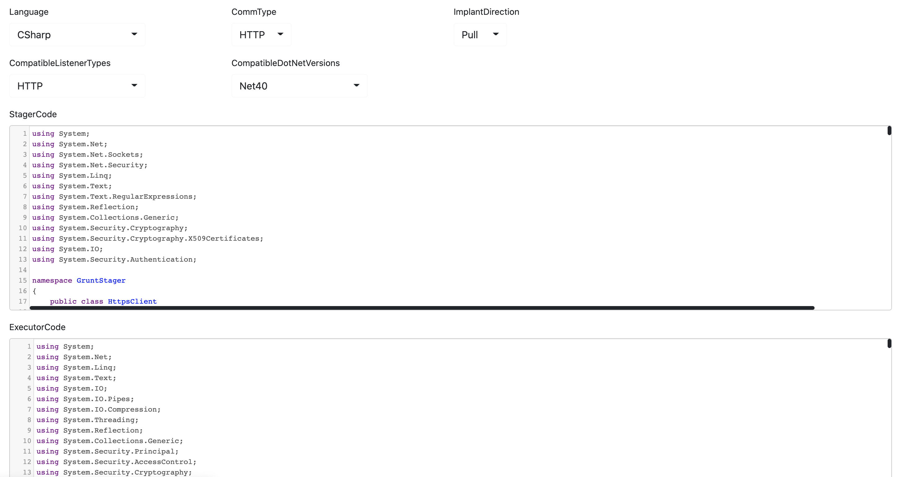

> based on Covenant commit id c53155615563cf68979820356b8430e4eb01207d

**Usage:**

**1. Create a new Implant Template with the configuration in the figure below, paste the DomainBorrowingHttpsStager.cs to the StagerCode, and paste the DomainBorrowingHttpsExecutor.cs to the ExecutorCode**



**2. replace the Addr, Port, SNI in the StagerCode with your own configuration**

```C#
// ---------------------- configuration ----------------------
string Addr = "staging.fontawesome.com"; // IP or Domain Name
int Port = 443;
string SNI = "img.fontawesome.com";
// -----------------------------------------------------------
```

**3. Create a new listener, the ConnectPort and ConnectAddresses are not used in the template, so ignore them**

**4. When you create a new Launcher, select the template you just created **

